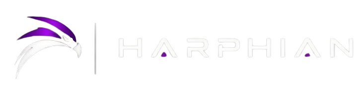

# Harphian FTC — Control System

<p align="center">
  
</p>

**FTC DECODE 2025–2026 | TeleOp Control System**

Sistema de controle para robô FTC com **Mecanum Drive**, controle de movimento suavizado e mecanismo de lançamento de Artifacts.

</p>

---

# Overview

O **Harphian FTC Control System** é o software responsável pelo controle em modo **TeleOp** do robô da equipe Harphian para a temporada **FIRST Tech Challenge DECODE 2025–2026**.

Desenvolvido em **Java utilizando FTC SDK**

---

# Features

## Mecanum Drive

Sistema de movimentação omnidirecional utilizando quatro motores independentes.

Suporta:

* Movimento frontal e traseiro
* Movimento lateral
* Rotação no próprio eixo
* Controle individual das rodas
* Normalização automática de potência

---

## Smooth Drive Control

Sistema de suavização de potência desenvolvido para melhorar o controle do robô.

Inclui:

* Rampa de aceleração
* Rampa de desaceleração
* Zona morta configurável
* Compensação de atrito estático

Benefícios:

* Menos trancos durante aceleração
* Maior estabilidade
* Controle mais preciso em partidas

---

# Hardware Configuration

## Hardware Map

| Nome no Código    | Tipo    | Função                         |
| ----------------- | ------- | ------------------------------ |
| `frontLeftDrive`  | DcMotor | Motor dianteiro esquerdo       |
| `frontRightDrive` | DcMotor | Motor dianteiro direito        |
| `backLeftDrive`   | DcMotor | Motor traseiro esquerdo        |
| `backRightDrive`  | DcMotor | Motor traseiro direito         |
| `shootwheel`      | DcMotor | Motor do sistema de lançamento |
| `artifactstopper` | Servo   | Controle da trava do Artifact  |

---

# Driver Controls

## Xbox Controller Layout

| Entrada       | Ação                       |
| ------------- | -------------------------- |
| LT / L2       | Movimento para frente      |
| RT / R2       | Movimento para trás        |
| LB            | Movimento lateral esquerdo |
| RB            | Movimento lateral direito  |
| Right Stick X | Rotação (Yaw)              |
| B             | Ativar lançamento          |

---

# Configuration Parameters

Localizados no método:

```java
runOpMode()
```

| Parâmetro             | Valor padrão | Descrição                         |
| --------------------- | ------------ | --------------------------------- |
| `ZONA_MORTA`          | `0.05`       | Limite mínimo dos analógicos      |
| `ZONA_MORTA_GATILHO`  | `0.03`       | Sensibilidade dos gatilhos        |
| `PASSO_ACELERACAO`    | `0.06`       | Velocidade de aumento de potência |
| `PASSO_DESACELERACAO` | `0.09`       | Velocidade de redução de potência |
| `ATRITO_ESTATICO`     | `0.04`       | Compensação inicial de movimento  |

---

# Telemetry

Durante o TeleOp o sistema envia informações para acompanhamento:

| Campo               | Descrição                      |
| ------------------- | ------------------------------ |
| `frente`            | Movimento frontal              |
| `lateral`           | Movimento lateral              |
| `giro`              | Rotação do robô                |
| `FE / FD / TE / TD` | Potência aplicada em cada roda |
| `RT / LT`           | Valores dos gatilhos           |
| `tiro (B)`          | Estado do lançador             |

Estados possíveis:

```
ATIRANDO
OFF
```

---

# Project Structure

---

# Installation

## Requirements

* Android Studio
* FTC SDK
* REV Control Hub
* FTC Driver Station
* Java JDK compatível

---

# Development Status

| Sistema             | Status   |
| ------------------- | -------- |
| Mecanum Drive       | Complete |
| Smooth Acceleration | Complete |
| Artifact Launcher   | Complete |
| Telemetry           | Complete |
| PID Control         | Planned  |
| Auto Aim            | Planned  |

---

# Future Improvements

Planejado:

* Controle PID de velocidade
* Controle automático do shooter
* Melhor filtragem de joystick
* Presets de lançamento
* Sensores de posicionamento
* Integração com Autonomous

---

# Version History

## V0.2 — Initial Release

Primeira versão funcional contendo:

* Controle Mecanum
* Sistema de aceleração
* Sistema de lançamento
* Telemetria básica

---

<div align="center">

**Harphian FTC Team**
FTC DECODE 2025–2026

</div>
